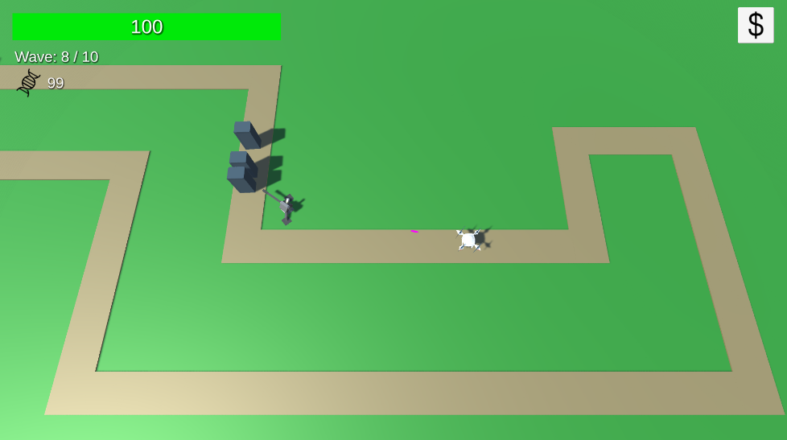
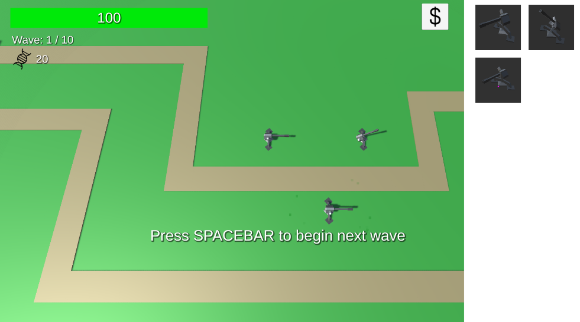
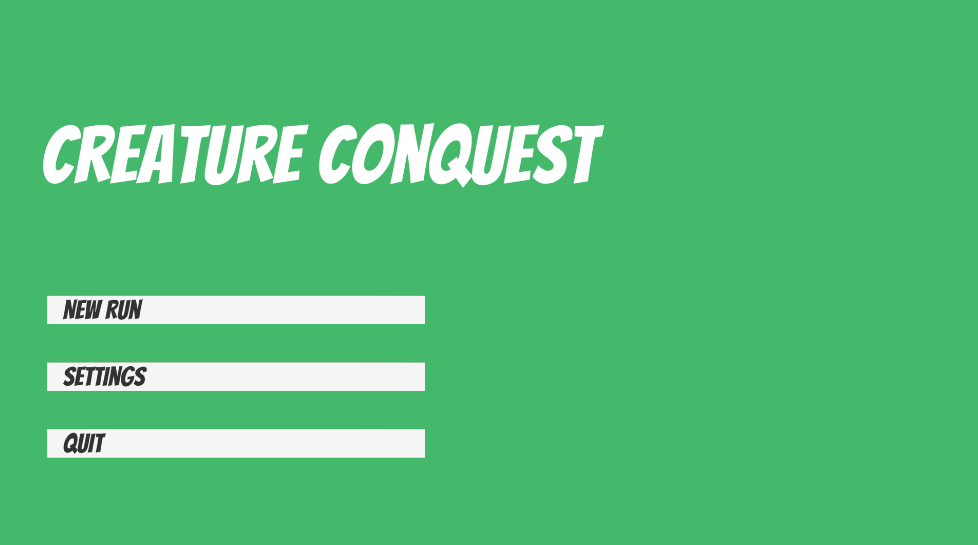

# Creature Conquest
Creature Conquest is a 3D tower defense video game developed in the Unity game engine. The game aims to put a new spin on the widely popular tower defense genre by introducing roguelike elements such as permadeath and progression. Players embark on ‘runs’ where they attempt a series of levels. Win or lose, players unlock new towers and upgrades that can be utilized on subsequent runs.

## Screenshots

## Info
Created by Team 34 for the course CS 426 - Senior Projects in Computer Science at the University of Nevada, Reno. 

The team members are:
 - Justin Casuga
 - Edward Martinez Anaya
 - Alexander Perez
 - Gustavo Rubio

Version Used: Unity 2022.3.9f1 (LTS)